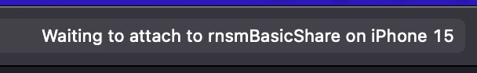

# Debugging the iOS share extension

If you're seeing unexpected behavior on iOS, you'll want to debug the native share extension code.

## Set breakpoints in Xcode

1. Open your app's iOS project in Xcode (using the `.xcworkspace` file).
2. Navigate to your app's share extension folder (in the basic example project, `rnsmBasicShare`) and click on the `ShareViewController` file. Click line numbers in this file to add debugger breakpoints.

### Adding breakpoints to other files

If you want to add breakpoints in other files, not just the view controller, here are a few ways to find them so you can open them:

1. Follow your code path by right-clicking on code and using `Jump to definition` to add specific breakpoints within that implementation
2. If you know what file you want, you can filter the project for it by focusing the project filter with `CMD+Alt+J` and search for it (try "ShareMenu").
3. To search for text in the whole project, use `CMD+Shift+F` to bring up the search menu. If you want your search to include Pods, including all the files in this library, make sure the "Search Scope" beneath the search field says "In Workspace".

## Attach to the share extension process before it starts

The easiest way to debug the share extension is to build and run your main app like you normally would, and then tell the Xcode debugger to attach to the share extension when it starts.

1. Build and run your main app.
2. In Xcode, navigate to "Debug" > "Attach to process by PID or name...".
3. In the "PID or Process Name" field, input the name of your share extension target (in the basic example project, this is `rnsmBasicShare`). In the bar at the top of the Xcode window, you should see "Waiting to attach to *shareExtensionProcessName*...".
  
4. On your iOS simulator or device, launch your share extension by sharing something to it. You should see "Running *shareExtensionProcessName*..." in th e top bar now.
5. Use your share extension until you hit your first breakpoint. You should now be able to use the debugger in Xcode.
  
6. Once you finish using the share extension, the debugger will detach and the top bar will say "Finished...". If you need to debug again, follow these steps again, starting from "Debug" > "Attach to process by PID or name...".

### Tips 

1. Attaching by name, instead of picking from the list of existing processes, is useful in case you might have an existing `rnsmBasicShare` process that did not exit correctly. 
2. If you see "Running *shareExtensionProcessName*..." instead of "Waiting", that means the debugger attached to an already-running process instead. Try closing all apps in use on your device and try again.
3. If you need to attach the debugger to the share extension repeatedly, you can add a custom keybinding for "Attach to process by PID or name..." under "Xcode" > "Settings" > "Key bindings".

For more information on how to use the Xcode debugger, or other debugging tools, see [Apple's documentation](https://developer.apple.com/documentation/xcode/diagnosing-and-resolving-bugs-in-your-running-app).